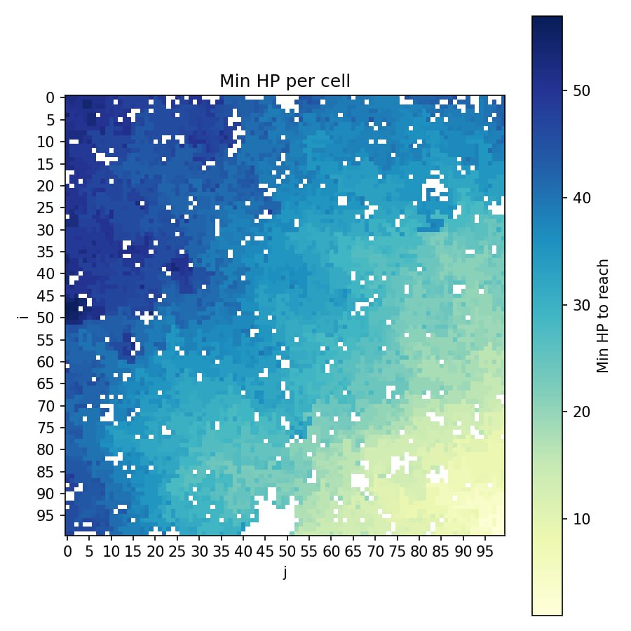
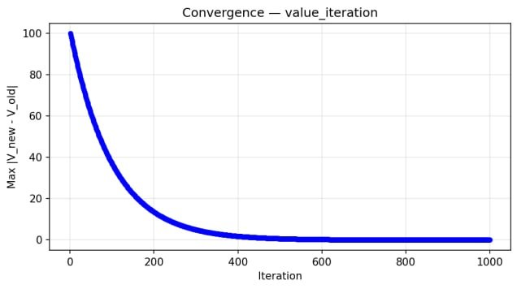
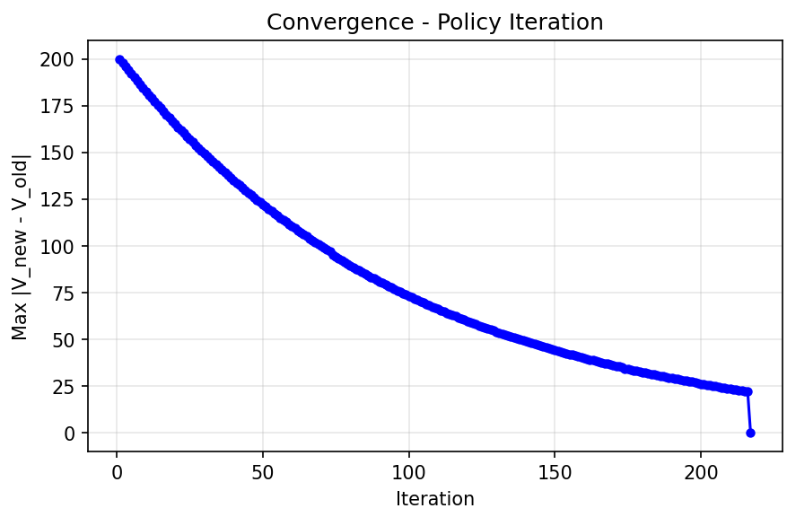
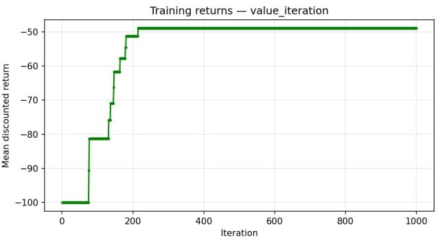
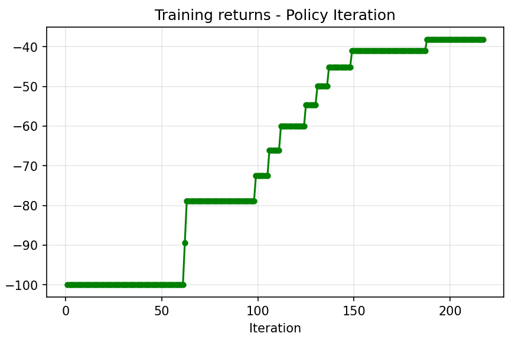
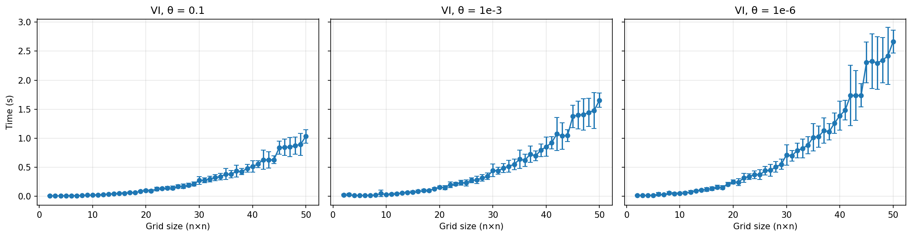
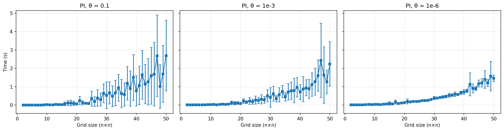
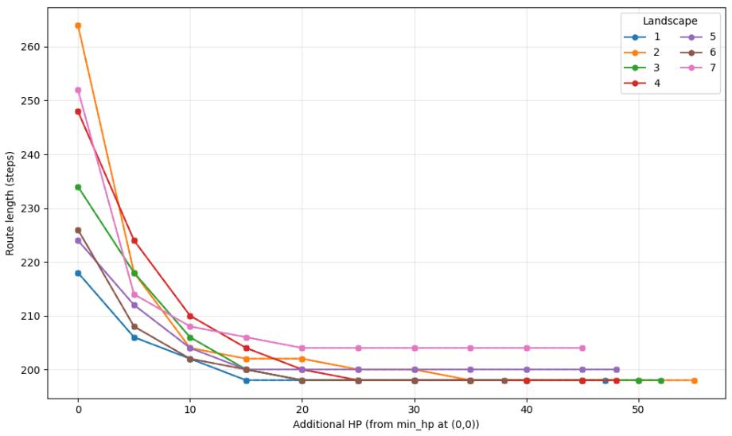

# Parkour — Reinforcement Learning with Dynamic Programming

## 1. Task Description

**Parkour** is a deterministic, episodic grid-world environment defined on an $N \times N$ grid.
Each cell $(i, j)$ represents the rooftop of a building with integer height $h_{ij}$.
The agent starts at some random start cell $(i_{\text{start}}, j_{\text{start}})$ with calibrated health points and must reach the bottom-right corner $(N{-}1,\; N{-}1)$ as quickly as possible while staying alive.

<p align="center">
  
</p>
<p align="center">
  <em> The sample of the playing of the agent according to the learned optimal policy through Policy Iteration algorithm. </em>
</p>

### State Space

Each state is a triple:

$$s = (i,\; j,\; \text{hp})$$

| Component | Range | Meaning |
|-----------|-------|---------|
| $i$ | $\{0, 1, \ldots, N{-}1\}$ | Row index |
| $j$ | $\{0, 1, \ldots, N{-}1\}$ | Column index |
| $\text{hp}$ | $\{0, 1, \ldots, \text{hp}_{\text{max}}\}$ | Current health points |

Total number of states: $|\mathcal{S}| = N \times N \times (\text{hp}_{\text{max}} + 1)$.

### Action Space

$$\mathcal{A} = \{\text{UP},\; \text{DOWN},\; \text{LEFT},\; \text{RIGHT}\}$$

Each action attempts to move the agent one cell in the chosen direction.

### Transition Function $T(s, a)$

The environment is **deterministic**: given state $s = (i, j, \text{hp})$ and action $a$, the next state $s' = T(s, a)$ is uniquely determined.

Let $(i', j')$ be the target cell of action $a$ from $(i, j)$, and define the signed height difference:

$$\Delta h = h_{i'j'} - h_{ij}$$

The move is **invalid** (agent stays in place, $T(s,a) = s$) if:
- $\text{hp} \leq 0$ — agent is dead
- $(i', j')$ is out of bounds — wall collision
- $\Delta h > 3$ — jump too high

For **valid** moves, fall damage is computed as:

$$\text{damage} = \max(0,\; -\Delta h - 1) = \max(0,\; h_{ij} - h_{i'j'} - 1)$$

Jumping up or sideways costs 0 HP; jumping down by 1 costs 0 HP; jumping down by $k > 1$ costs $k - 1$ HP.

The full transition function:

$$T(s, a) = \begin{cases} s & \text{if } \text{hp} \leq 0 \quad \text{(dead)} \ \text{or if } (i, j) = (N - 1, N - 1)  \\\\ s & \text{if } (i',j') \text{ out of bounds} \\\\ s & \text{if } \Delta h > 3 \quad \text{(jump too high)} \\\\ (i',\; j',\; \text{hp} - \text{damage}) & \text{otherwise} \end{cases}$$

**Terminal states** (absorbing, no further transitions):
- **Victory:** agent reaches $(N{-}1,\, N{-}1)$ with $\text{hp} > 0$
- **Death:** agent's HP drops to $\text{hp}' \leq 0$ after a jump

### Reward Function

$$r(s, a) = \begin{cases} -100 & \text{if } \text{hp}' \leq 0 \ \text{and hp} > 0 \quad \text{(death - agent die bacause of the move)} \\\\ +100 & \text{if }(i, j) \neq (N{-}1,\, N{-}1),\ (i', j') = (N{-}1,\, N{-}1) \text{ and } \text{hp}' > 0 \quad \text{(victory)} \\\\
 0 &  \text{if hp } \leq 0 \ \text{or if } (i, j) = (N - 1, N - 1) \\\\
 -1 & \text{otherwise} \quad \text{(step penalty)} \end{cases}$$

> **Note:** Death is checked before victory. If the agent jumps onto the goal cell but $\text{hp}' \leq 0$, the outcome is death.

### Landscape Generation & HP Calibration

Heights $h_{ij}$ are sampled uniformly from $\{1, \ldots, 10\}$. After sampling, Dijkstra's algorithm computes the minimum total fall damage along the optimal path from $(i, j)$ to $(N{-}1,\, N{-}1)$ (see section 2.1 for details). The starting HP is then calibrated as:

$$\text{hp}_{\text{start}} = \text{cost}_{\min} + 1$$

This guarantees solvability while keeping the HP constraint tight — the agent must learn to navigate efficiently and cannot afford careless routes.

<p align="center">
  
  <br/>
  <em>Minimum HP map. In each cell on the grid we compute the minimum start hp for an agent to go to the finish cell (N-1, N-1). The closer to the finish (right-down corner), the less hp an agent needs to achieve the target. White cells indicate zones from which the final cell is unreachable with any starting hp.   </em>
</p>

---

## 2. Algorithms

### 2.1 Dijkstra's Algorithm

We use Dijkstra's algorithm to find the **minimum-damage path** from a given cell $(i_0, j_0)$ to the goal cell $(N{-}1,\, N{-}1)$. To do this we define a graph, where vertices are just grid cells (not states of the environment !) and edge weights represent fall damage. More precisely: $$w\big((i,j) \to (i',j')\big) = \max\!\big(0,\; h_{ij} - h_{i'j'} - 1\big), \quad \text{and edge absent if (because of impossibility to jump too high) } \Delta h > 3$$

This serves two purposes: (1) validating that a generated landscape is solvable, and (2) calibrating the agent's starting HP.

$$\boxed{
\begin{aligned}
& \textbf{Algorithm: Dijkstra's Shortest Path} \\\\[4pt]
& \textbf{Input: } \text{Graph } G = (V, E, w), \text{ start node } s, \text{ goal node } g \\\\
& \textbf{Output: } \text{Minimum cost } d[g], \text{ shortest path } P \\\\[4pt]
& 1.\quad \text{Initialize } d[v] \leftarrow \infty \;\forall\, v \in V;\quad d[s] \leftarrow 0 \\\\
& 2.\quad \text{Priority queue } Q \leftarrow \{(0, s)\} \\\\
& 3.\quad \textbf{while } Q \neq \emptyset: \\\\
& 4.\quad \qquad (c, u) \leftarrow Q.\text{pop\\_min}() \\\\
& 5.\quad \qquad \textbf{if } u = g: \text{ return } (d[g],\; P) \\\\
& 6.\quad \qquad \textbf{for } (v, w_{uv}) \in \text{neighbors}(u): \\\\
& 7.\quad \qquad \qquad \textbf{if } d[u] + w_{uv} < d[v]: \\\\
& 8.\quad \qquad \qquad \qquad d[v] \leftarrow d[u] + w_{uv} \\\\
& 9.\quad \qquad \qquad \qquad \text{parent}[v] \leftarrow u \\\\
& 10.\quad \qquad \qquad \qquad Q.\text{push}((d[v], v)) \\\\
& 11.\quad \text{return } (\infty, \; \text{None})
\end{aligned}
}$$

### 2.2 Value Iteration

Value Iteration (VI) computes the optimal value function by iteratively applying the **Bellman optimality equation** until convergence. In our deterministic setting the update simplifies to:

$$V_{k+1}(s) = \max_{a \in \mathcal{A}} \Big[ r(s, a) + \gamma \, V_{k}\!\big(T(s, a)\big) \Big]$$

$$\boxed{
\begin{aligned}
& \textbf{Algorithm: Value Iteration} \\\\[4pt]
& \textbf{Input: } \text{MDP } (\mathcal{S}, \mathcal{A}, T, r, \gamma), \text{ threshold } \theta \\\\
& \textbf{Output: } \text{Optimal value function } V^{\ast}, \text{ optimal policy } \pi^{\ast} \\\\[4pt]
& 1.\quad V(s) \leftarrow 0 \;\;\forall\, s \in \mathcal{S} \\\\
& 2.\quad \textbf{repeat:} \\\\
& 3.\quad \qquad \delta \leftarrow 0 \\\\
& 4.\quad \qquad \textbf{for each } s \in \mathcal{S}: \\\\
& 5.\quad \qquad \qquad v \leftarrow V(s) \\\\
& 6. \quad \qquad \qquad \pi(s) \leftarrow \arg\max_{a} \big[ r(s,a) + \gamma \, V(T(s,a)) \big] \\\\
& 7.\quad \qquad \qquad V(s) \leftarrow  r(s,\pi(s)) + \gamma \, V(T(s,\pi(s))) \\\\
& 8.\quad \qquad \qquad \delta \leftarrow \max(\delta, \; |v - V(s)|) \\\\
& 9.\quad \textbf{until } \delta < \theta \\\\[4pt]
& 10. \quad \textbf{return} \; V, \; \pi
\end{aligned}
}$$

**Convergence.** Value Iteration is guaranteed to converge because the Bellman optimality operator is a $\gamma$-contraction in the $\|\cdot\|\_\infty$ norm. At each iteration the error decreases by at least a factor of $\gamma$:

$$\|V_{k+1} - V^{\ast}\|_\infty \;\leq\; \gamma\,\|V_k - V^{\ast}\|_\infty$$

Hence convergence is geometric with rate $\gamma$. In practice, with $\gamma = 0.99$ and threshold $\theta = 10^{-6}$, VI converges within several hundred iterations.

<p align="center">
  
  <em> Dependence on the outer iteration of the updated at current iteration and old one V-functions </em>
</p>

**Plot description:**
The plot shows $\|V\_{k+1} - V_k\|\_\infty$ decreasing monotonically towards zero with each iteration, confirming convergence. Since the Bellman optimality operator is a $\gamma$-contraction, this guarantees that $V_k \to V^{\ast}$. Note, however, that a small $\|V\_{k+1} - V_k\|\_\infty$ does not tell us the exact iteration at which the derived policy $\pi\_k$ becomes optimal — the value function may still be refining while the policy has already stabilized.


### 2.3 Policy Iteration

Policy Iteration (PI) alternates between two phases: **policy evaluation** (computing $V^{\pi}$ for the current policy) and **policy improvement** (extracting a greedy policy from $V^{\pi}$):

$$\boxed{
\begin{aligned}
& \textbf{Algorithm: Policy Iteration} \\\\[4pt]
& \textbf{Input: } \text{MDP } (\mathcal{S}, \mathcal{A}, T, r, \gamma), \text{ threshold } \theta \\\\
& \textbf{Output: } \text{Optimal value function } V^{\ast}, \text{ optimal policy } \pi^{\ast} \\\\[4pt]
& 1.\quad \pi(s) \leftarrow \text{arbitrary action} \;\;\forall\, s \in \mathcal{S} \\\\
& 2.\quad \textbf{repeat:} \\\\[2pt]
& \quad\quad \textbf{Policy Evaluation:} \\\\
& 3.\quad \qquad \textbf{repeat:} \\\\
& 4.\quad \qquad \qquad \delta \leftarrow 0 \\\\
& 5.\quad \qquad \qquad \textbf{for each } s \in \mathcal{S}: \\\\
& 6.\quad \qquad \qquad \qquad v \leftarrow V(s) \\\\
& 7.\quad \qquad \qquad \qquad V(s) \leftarrow r(s, \pi(s)) + \gamma \, V(T(s, \pi(s))) \\\\
& 8.\quad \qquad \qquad \qquad \delta \leftarrow \max(\delta, \; |v - V(s)|) \\\\
& 9.\quad \qquad \textbf{until } \delta < \theta \\\\[2pt]
& \quad\quad \textbf{Policy Improvement:} \\\\
& 10.\quad \qquad \pi_{\text{new}}(s) \leftarrow \arg\max_{a} \big[ r(s,a) + \gamma \, V(T(s,a)) \big] \;\;\forall\, s \\\\
& 11.\quad \textbf{until } \pi_{\text{new}} = \pi \\\\
& 12.\quad \text{return } V, \; \pi
\end{aligned}
}$$

**Convergence.** Policy Iteration converges in a finite number of steps because the number of deterministic policies is finite ($|\mathcal{A}|^{|\mathcal{S}|}$) and each improvement step strictly increases the value of at least one state (or the policy is already optimal). In practice, PI often converges in very few outer iterations (typically ${<} 10$), though each iteration requires solving a full policy evaluation sub-problem.

<p align="center">
  
  <em> Dependence on the outer iteration of the updated at current iteration and old one V-functions </em>
</p>

**Plot description:**
Similarly to VI, $\|V\_{k+1} - V_k\|\_\infty$ decreases over iterations. However, a distinctive feature of PI is visible at the end of the curve: a sharp drop to zero. This happens because PI converges in a **finite** number of outer steps — once the greedy policy no longer changes ($\pi\_{\text{new}} = \pi$), the algorithm terminates. Unlike VI, which asymptotically approaches the optimum, PI reaches the exact optimal policy and stops abruptly.

### Per-Episode Reward Over Training Iterations

**Setup:**

To evaluate how quickly each algorithm learns a good policy, we measure the **discounted cumulative reward** at each main iteration of VI and PI. The procedure is:

1. Generate random map of size $100 \times 100$.
2. For this map, sample $k$ random starting cells (they are fixed).
3. At every iteration of VI / PI, roll out the current policy from each starting cell and compute the discounted episode reward.
4. Average these rewards across starting cells to obtain a single score per iteration.

**Result:**

<p align="center">
  
  <br/>
  <em>Value Iteration: average discounted reward per episode as a function of training iteration, averaged across starting cells for a single map.</em>
</p>

<p align="center">
  
  <br/>
  <em>Policy Iteration: average discounted reward per episode as a function of outer iteration, averaged across starting cells for a single map.</em>
</p>

**Note on explanation of the result:**

Both plots demonstrate that the average episode reward for a single map increases monotonically over training iterations and eventually plateaus, indicating that the policy has converged to a near-optimal solution. 

### A Note on Q-Learning

We do **not** use Q-learning in this project. Since the transition function $T(s, a)$ is known, we have complete information about state transition probabilities. In this setting, knowledge of the value function $V(s)$ is equivalent to knowledge of the action-value function $Q(s, a)$, because (for our case of deterministic transitions):

$$Q(s, a) = r(s, a) + \gamma \, V\!\big(T(s, a)\big)$$

The Q-function can be recovered from $V$ in a single step with no additional learning. Therefore, model-free methods like Q-learning offer no advantage here — Value Iteration and Policy Iteration are sufficient.

---

## 3. Ablation Studies

### 3.1 Convergence Threshold $\theta$

We study how the convergence threshold $\theta$ affects the amount of the time required for convergence across different grid sizes, for both Value Iteration and Policy Iteration.

**Value Iteration:**

<p align="center">
  
</p>

**Plot Description:**
The plots show a fairly expected result: a larger $\theta$ causes Value Iteration to terminate earlier, reducing overall runtime. However, if $\theta$ is set too large, the resulting policy may be far from optimal since the value function has not yet converged sufficiently. For this reason, choosing $\theta$ remains a non-trivial trade-off between computation speed and solution quality.

**Policy Iteration:**

<p align="center">
  
</p>

Each plot shows three curves corresponding to different $\theta$ values, with the x-axis representing the parkour grid size and the y-axis representing the amount of time to converge.

**Plot Description:**
From a theoretical perspective, a larger $\theta$ has two competing effects. On one hand, it reduces the number of inner iterations in policy evaluation, potentially speeding up each outer step. On the other hand, a less accurate value function estimate may require more outer iterations for the policy to stabilize, increasing total runtime. Our plots show that the second effect dominates: a larger $\theta$ slows down the algorithm overall. This means that for PI, precise evaluation of the value function is more important for convergence speed than reducing inner iteration count.

### 3.2 Dependence of Optimal Path Length on $\text{hp}_{\text{start}}$

**Setup:**

We investigate how the starting health $\text{hp}_{\text{start}}$ affects the length of the optimal path found by the agent. The intuition is straightforward: with more HP the agent can afford to take shorter but riskier routes (jumping off tall buildings), whereas with limited HP it must take longer detours to avoid fatal falls.

The procedure is as follows:

1. Generate several random maps of size $100 \times 100$.
2. For each map, fix the starting cell at $(0, 0)$ and vary $\text{hp}_{\text{start}}$ over a range of values.
3. For each $\text{hp}_{\text{start}}$, run VI (or PI) to obtain the optimal policy, then roll it out and record the resulting path length.

<p align="center">
  
  <em> Optimal path length dependence on additional HP </em>
</p>

**Observations:**

- The optimal path length **non-strictly decreases** as $\text{hp}_{\text{start}}$ increases — more health allows the agent to choose shorter, higher-damage routes.
- Beyond a certain HP threshold, the path length saturates at the **Manhattan distance** $2(N - 1)$ between the start $(0, 0)$ and the goal $(N{-}1,\, N{-}1)$, meaning the agent has enough HP to take the geometrically shortest route regardless of fall damage.

---

## 4. Agents evaluation

We evaluated our agents on 10 maps, 10 random starting cells for each map. 10 starting points are fixed for each map and shared across agents. All in all every agent is evaluated on 100 episodes. For each starting point all agents are given the minimum number of hp to win the game (to come to the final cell alive).

We compared the following **agents**:
- Value iteration agent
- Policy iteration agent
- Safest Path agent

Safest Path agent uses Dijkstra's algorithm to find the minimum-damage path to reach the target cell. 

- Shortest Path agent

Safest Path agent uses Dijkstra's algorithm to find the minimum-step path to reach the target cell without any consideration of his hp.

- Budget Greedy agent

A local heuristic that combines greediness toward the goal with adaptive caution. At each step, it computes a per-step HP budget based on remaining HP and Manhattan distance to the goal:
  $$\text{budget}\_{\text{per step}} = (\text{hp} - 1) \big/ \text{manhattan}\big((i,j), (7,7)\big)$$
It then selects the action that minimises Manhattan distance to (7, 7), subject to the constraint that the fall damage does not exceed the budget. If no action satisfies the budget, the agent picks the action with the lowest damage. This agent has no global knowledge of the map — it only uses current HP and position.

- Random agent
 
 At each step, selects a uniformly random action from the four directions. Invalid moves (out of bounds or jump too high) result in a self-loop. Serves as the lower bound on performance.

We used the following **metrics** for evaluation: 
- Success rate: Fraction of episodes where the agent reaches (7,7) alive. Bigger is better.
- Avg steps: Mean number of steps over all 100 episodes. Failed episodes (death or timeout) are not considered. Lower is better.
- Avg reward: Mean discounted return over all 100 episodes (including failures)

```
 FINAL AGGREGATED RESULTS (Averaged across all maps and starting cells)
================================================================================
Agent Name                   | Success Rate   | Avg Steps  | Avg Reward
--------------------------------------------------------------------------------
value_iteration              |    100.0%      |      125.7 |      -34.2
policy_iteration             |    100.0%      |      125.7 |      -34.2
Safest Path                  |    100.0%      |      130.8 |      -36.5
Shortest Path                |      2.0%      |        9.0 |      -96.3
Budget Greedy                |      1.0%      |        3.0 |      -98.0
Random                       |      0.0%      |        nan |     -100.0
================================================================================
```

As we can see from this table, VI and PI agents always win the game, as well as Safest path agent. Safest path agent makes more steps to reach the goal in comparison with VI/PI agents. Even though Budget Greedy and Shortest Path agents make less steps per episode to reach the goal, their success rate is close to zero (they are sometimes very lucky to win the game where a starting point is close to the finish). The main comparison criteria here is avg reward. It is maximum for VI/PI agents which highlights the superior performance.

Also, we decided to check whether our results will remain stable when agents start their episode with not-minimum hp, but with some surplus. So, we increased hp for each starting point by 30%. 

```
 FINAL AGGREGATED RESULTS (Averaged across all maps and starting cells) +30% starting hp 
================================================================================
Agent Name                   | Total SR   | Avg Steps  | Avg Reward
--------------------------------------------------------------------------------
value_iteration              |    100.0% |      100.9 |      -19.9
policy_iteration             |    100.0% |      100.9 |      -19.9
Safest Path                  |    100.0% |      130.8 |      -36.5
Shortest Path                |     26.0% |       76.0 |      -72.5
Budget Greedy                |      1.0% |        3.0 |      -98.0
Random                       |      1.0% |       25.0 |      -98.4
================================================================================
```

As we can see from the table above, superiority of VI/PI agents remains the same even in hp surplus scenario, when Shortest Path agent significantly increased his success rate and Avg reward per episode.    


## 5. Summary

This project implements and compares two classical dynamic programming algorithms — **Value Iteration** and **Policy Iteration** — on the Parkour grid-world environment, where an agent must navigate an $N \times N$ grid of buildings with varying heights while managing limited health points.

**Environment design:**
- Dijkstra's algorithm is used both to validate landscape solvability and to calibrate the starting HP ($\text{hp}\_{\text{start}} = \text{cost}\_{\min} + 1$), ensuring a tight but feasible constraint.
- The minimum HP map visualization confirms that cells closer to the goal require less health, as expected.

**Algorithm convergence:**
- Both VI and PI converge to the same optimal policy, as guaranteed by theory.
- VI converges asymptotically — $\|V\_{k+1} - V_k\|\_\infty$ decreases smoothly due to the $\gamma$-contraction property, though the policy may stabilize before the value function fully converges.
- PI converges in a finite number of outer steps with a characteristic sharp drop to zero once the policy stabilizes, but each step is more expensive due to the full policy evaluation phase.

**Ablation studies:**
- For VI, a larger convergence threshold $\theta$ reduces runtime but risks suboptimal policies — a direct speed-vs-quality trade-off.
- For PI, a larger $\theta$ unexpectedly *slows down* the algorithm: imprecise value function estimates during policy evaluation lead to more outer iterations, outweighing the savings from fewer inner iterations.
- The optimal path length decreases with increasing $\text{hp}_{\text{start}}$ and saturates at the Manhattan distance $2(N-1)$ when the agent has enough HP to ignore fall damage entirely.

**Why not Q-learning:** since the transition function $T(s,a)$ is fully known, $Q(s,a)$ can be recovered from $V(s)$ in one step, making model-free methods redundant.

---

## 5. Reproduction Instructions

Check LAUNCH.md for details

